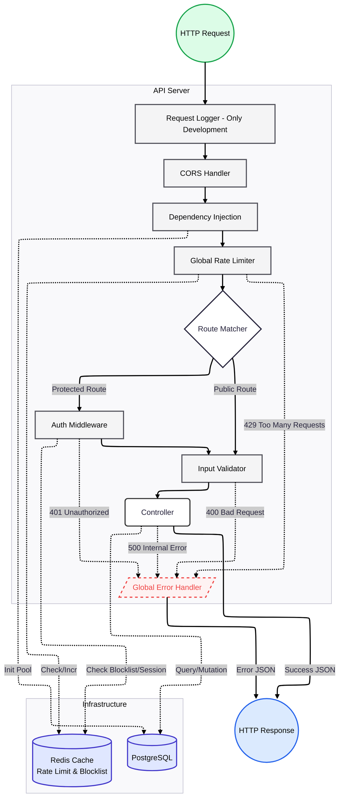

```mermaid
---
config:
  layout: elk
  theme: redux
---
flowchart TD
    %% --- Definição de Estilos (Classes) ---
    classDef process fill:#ffffff,stroke:#333,stroke-width:2px,rx:5,ry:5
    classDef middleware fill:#f4f4f5,stroke:#52525b,color:#000
    classDef datastore fill:#e0e7ff,stroke:#4338ca,color:#000
    classDef errorNode fill:#fef2f2,stroke:#ef4444,color:#ef4444,stroke-dasharray: 5 5
    classDef request fill:#dcfce7,stroke:#16a34a,stroke-width:2px,color:#000
    classDef response fill:#dbeafe,stroke:#2563eb,stroke-width:2px,color:#000

    %% --- Entrada ---
    Request((HTTP Request)):::request

    %% --- Infraestrutura ---
    subgraph Infra [Infrastructure]
        Postgres[(PostgreSQL)]:::datastore
        Redis[(Redis Cache<br/>Rate Limit & Blocklist)]:::datastore
    end

    %% --- Servidor API ---
    subgraph Server [API Server]
        direction TB
        
        %% Pipeline Global (Middleware Comum)
        Logger[Request Logger - Only Development]:::middleware
        Cors[CORS Handler]:::middleware
        DB_Inject[Dependency Injection]:::middleware
        RL_Global[Global Rate Limiter]:::middleware
        
        %% Fluxo Sequencial Global
        Logger --> Cors --> DB_Inject --> RL_Global
        
        %% Roteador
        Router{Route Matcher}
        RL_Global --> Router

        %% --- Decisão: Rota Protegida vs Pública ---
        
        %% Middleware de Auth (Opcional/Condicional)
        Auth_Guard[Auth Middleware]:::middleware

        %% Validação de Schema (Genérico)
        Validator[Input Validator]:::middleware

        %% Controller (Lógica de Negócio)
        Controller[Controller]:::process

        %% Conexões do Roteador
        Router -->|Public Route| Validator
        Router -->|Protected Route| Auth_Guard
        
        %% Convergência
        Auth_Guard --> Validator
        Validator --> Controller

        %% Handler Global de Erros
        ErrorHandler[/Global Error Handler/]:::errorNode
    end

    %% --- Saída ---
    Response((HTTP Response)):::response
    Controller -->|Success JSON| Response
    ErrorHandler -->|Error JSON| Response

    %% --- Conexões Externas (Efeitos Colaterais) ---
    Request --> Logger
    
    %% Interações com Infra
    DB_Inject -.->|Init Pool| Postgres
    RL_Global -.->|Check/Incr| Redis
    Auth_Guard -.->|Check Blocklist/Session| Redis
    Controller -.->|Query/Mutation| Postgres

    %% --- Fluxos de Erro (Dashed) ---
    Auth_Guard -.->|401 Unauthorized| ErrorHandler
    Validator -.->|400 Bad Request| ErrorHandler
    RL_Global -.->|429 Too Many Requests| ErrorHandler
    Controller -.->|500 Internal Error| ErrorHandler
```